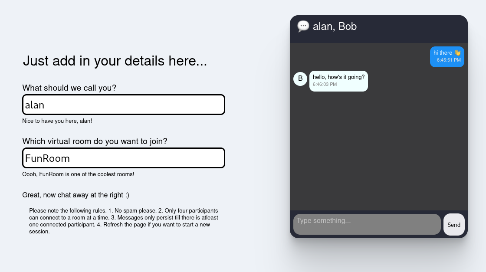

When developing simple client-side React applications, one often needs a touch
of backend services. Not an entire database (with its management &
administration needs) or high performance compute. These services have their own
use cases, but for simpler requirements, they often take more energy to set up
than necessary. It's also difficult to scale these services up or down depending
on usage, which might lead to unnecessary overhead (when you don't utilise them
fully) or service interruptions (due to traffic spikes).

Enters the notion of serverless infrastructure -- a paradigm of providing
backend services to the front-end on a as-used basis. Serverless vendors charge
usage, not bandwidth and hence solve two problems with one solution -- that of
boosting (cost) efficiency and scaling up on demand. This creates a refuge where
application developers can write and deploy code without worrying about
infrastructure needs. Like all refuges however, there are trade-offs in
inhabiting this system. For the usecase detailed in this post, serverless
computing suffices and I'll outline how I used Cloudflare's edge network as a
serverless platform.

When I first started this project, I wanted to build a live chat application,
one of the fundamental pieces of software in any social product. I made an
[app](https://github.com/busywhistling/live_chat) using the popular Javascript
[express](https://expressjs.com/) (server) and [socket.io](https://socket.io/)
(websocket) libraries which worked fine in local development. When it came to
deploying it online, I didn't want to just deploy it openly (without
authentication) as there might be bots crawling the internet, looking for open
websocket servers to spam and so on. On the other hand, I didn't want to use my
domain for authentication (and registration) services for this pet project. The
idea of using serverless JS workers came to me as I was thinking about how to
architect the application with the least possible backend exposure. Luckily,
several cloud vendors provide such services nowadays so it's only a matter of
time to integrate with their interfaces.

# Cloudflare workers
Cloudflare workers are JS modules / functions running on Cloudflare's global
network in over 200 cities around the world. Cloudflare's reputation of
providing DDOS protection services implies that they have spent time optimizing
resilient cloud networks and CDN services, and they offer to front web traffic
for other businesses. So in essence, a cloudflare worker is a reliable online JS
function which is run on CF's network servers anytime you call the function.
This is great for non-persistent (light) compute, but the workers platform also
[includes](https://developers.cloudflare.com/workers/platform/storage-objects)
simplified key-value storage and consistent distributed storage via Durable
Objects. Of interest to us is this last one, namely Durable Objects. We
want to implement a chat application (with it's UI layer written in React) over
a global distributed network. 

Suppose there are five participants in different parts of the world, talking in
a group chat. To provide real-time feedback, one needs low-latency coordination
among the servers closest to these users and even more importantly, the messages
in the group chat have to be in one order for all users (a fairly difficult
problem). See how quickly the problem of enforcing consistency over distributed
systems becomes demanding? Cloudflare's Durable Objects try to tackle this by
implementing a locking mechanism to enforce Global Uniqueness and using a
transactional single-threaded storage API while reading / modifying key-value
pairs. This suffices for a wide variety of use-cases (certainly ours in this
blog post), but you can also think of use-cases where you might need more local
(& better) consistency resolution (like in one particular geographical region).

Our
[worker](https://github.com/busywhistling/serverless_chat/blob/main/src/worker.js)
implements a `fetch` listener (wrapped in an error handler) and passes on API
requests further, to instantiate a ChatRoom class. The instance of this class
runs as a Durable Object and creates chatrooms while handling sessions to this
chatroom. Since we don't want to persist data, we don't store it anywhere and
all data is lost as soon as the websockets enabling the sessions are
disconnected / closed. The ChatRoom Durable Object also instantiates a
RateLimiter class to ensure worker compute is not abused by heavy traffic, but
is rather moderated via rate limiting.

# Passing callback functions to React's `useState`
One of the issues I came across while implementing the UI in React was to
re-render the components upon receiving messages through the web socket. React
components usually do not re-render until some state (which is being accessed in
the component) is updated. This is, in general, a strength of React as it promotes performant rendering while defering expensive operations -- namely, re-render _only_ when necessary. So when sometimes there is no explicit need of state in a component, external triggers of rendering are carried out by dummy state, like in this instance, a dummy `msgCount` state number.

Another issue I faced was sometimes encountering incoherent state updates (and
renders) in my App component. When using the `useState` hook, the setter
function (some form of `setState`) is used to update local state and ask React
to re-render the component (update the DOM). Usually, one often just calls
`setState` with a new value passed in as an object, for e.g.,
`setState(newState)`. What if our `newState` depends on the current `state`
variable? Directly accessing `state` is _not_ a reliable way to cause this
update as React handles state updates asynchronously. This doesn't show easily
in all applications (for instance, when some other state variable being updated
pushes this state variable to also be updated and saves our application from
breaking) or when the state update is a rather isolated low-cost operation
(which somehow escaped React's batching of operations for the next render). To
quote React's
[documentation](https://reactjs.org/docs/state-and-lifecycle.html#state-updates-may-be-asynchronous),
"Because `this.props` and `this.state` may be updated asynchronously, you should
not rely on their values for calculating the next state." Now I usually don't
face these failed "renders", but in this app, frequent websocket messages (which
often happen in fast succession) "failed to re-render the UI" and any further UI
updates almost "missed out" the state updates before (for e.g., if you're
appending a `messages` list with messages flowing from a websocket). At first, I
tried to fix this by adding more dummy state variables (without success) and
using `useEffect` and `useRef` hooks to force more re-renders, before finally
realizing the main problem. What I wanted was not _more renders_, but more
reliable _state updates_, as the excess renders also kept showing the old state,
although sometimes incoherently. _It wasn't the renders that were failing, but the state updates._

The conclusion is to pass callback functions to `setState` hooks when one needs
the current state or props to calculate the next state. React is then able to
reliably queue up these "pipes" / transformations to apply to the current state,
_without_ relying on what the current state actually is. This is almost so
important that there should be an ESLint plugin for this (and there is
[one](https://github.com/jsx-eslint/eslint-plugin-react/blob/master/docs/rules/no-access-state-in-setstate.md)).

This app has been pretty useful to me to acknowledge the subtleties of React's
`useState` hook (and rendering mechanism) and to understand how capable
serverless infrastructure is. Try out [the
app](https://paramjit.org/serverless_chat/), and let me know your thoughts!